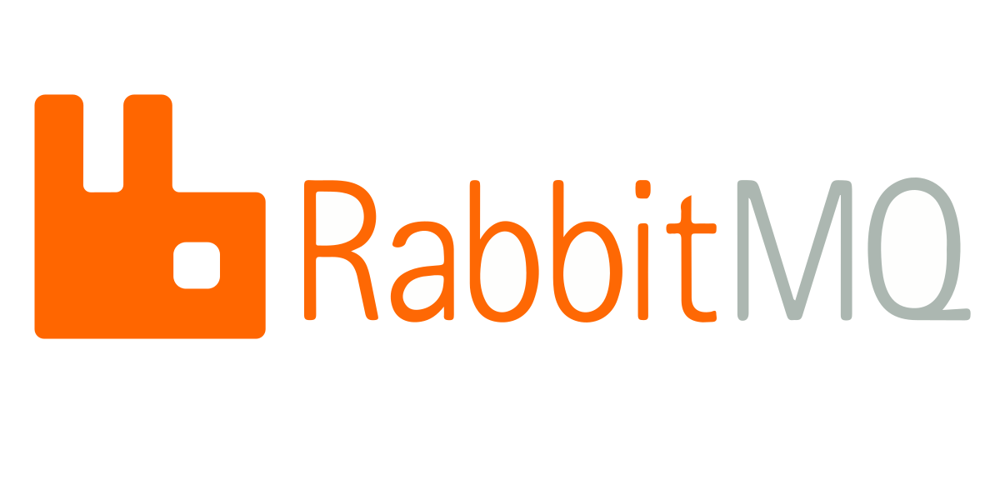

<h1 align="center">Apache-Camel</h1>

    

---

# 💻 About the project

- RabbitMQ is an open-source message-broker software that originally implemented the Advanced Message Queuing Protocol and has since been extended with a plug-in architecture to support Streaming Text Oriented Messaging Protocol, MQ Telemetry Transport, and other protocols.

---

## ⚙️ Activities

- [ ] RabbitMQ key concepts.
- [ ] Managing RabbitMQ from web user interface.
- [ ] Create publisher and consumer using Java (Spring Boot).
- [ ] Basic error handler if there is a failure during processing Rabbit MQ message.
- [ ] Retry mechanism on RabbitMQ if there is failure message.
- [ ] Handle message ordering.

---

## 🦸 Author

<a href="#">
    
 

Made by Douglas Souza 👋🏽 Get in touch!

---
## README versions

[English 🇺🇸](./README.md)# RabbitMQ
